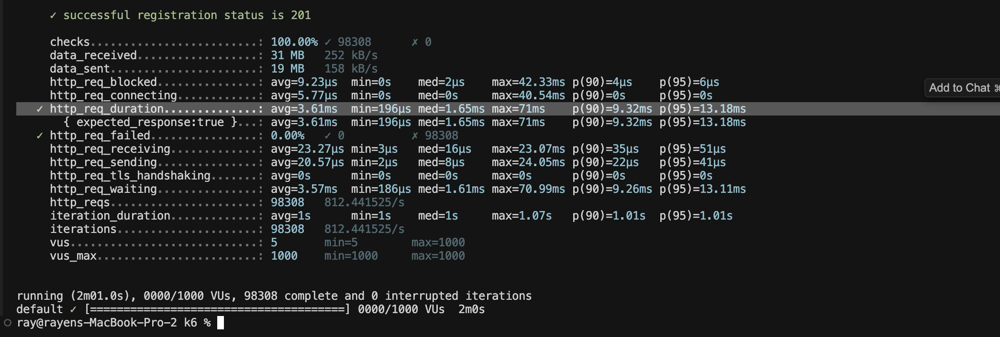
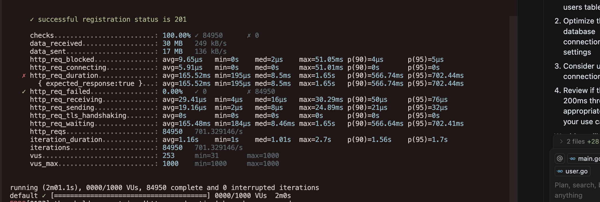
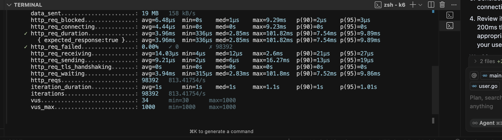
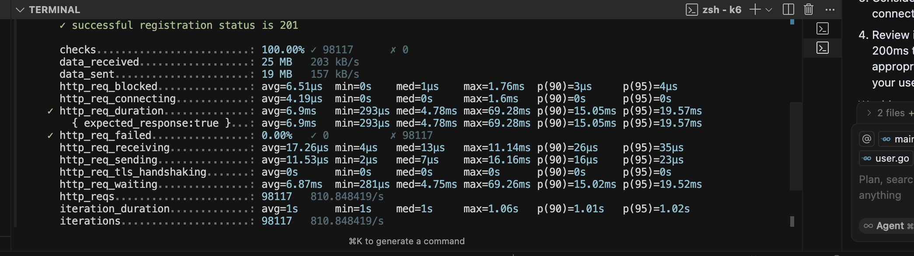

# Web Framework Performance Benchmark

This repository contains performance benchmarks comparing different web framework and database combinations:

- Gin (Go) + MongoDB
- Gin (Go) + PostgreSQL
- NestJS + MongoDB
- NestJS + PostgreSQL

## Overview

This project aims to compare the performance characteristics of popular web frameworks when paired with different databases. The benchmarks help developers make informed decisions about their tech stack based on performance metrics.

## Stack Combinations

### Gin + MongoDB


### Gin + PostgreSQL


### NestJS + MongoDB


### NestJS + PostgreSQL


## Project Structure

```
.
├── gin-mongo/        # Gin + MongoDB implementation
├── gin-postgres/     # Gin + PostgreSQL implementation
├── nest-mongo/       # NestJS + MongoDB implementation
├── nest-postgres/    # NestJS + PostgreSQL implementation
└── pics/            # Performance benchmark graphs
```

## Getting Started

Each implementation is in its own directory with its own setup instructions. Please refer to the specific README files in each directory for detailed setup and running instructions.

## Contributing

Feel free to contribute to this benchmark by:
1. Forking the repository
2. Creating your feature branch
3. Committing your changes
4. Pushing to the branch
5. Creating a new Pull Request

## License

This project is open source and available under the MIT License.


